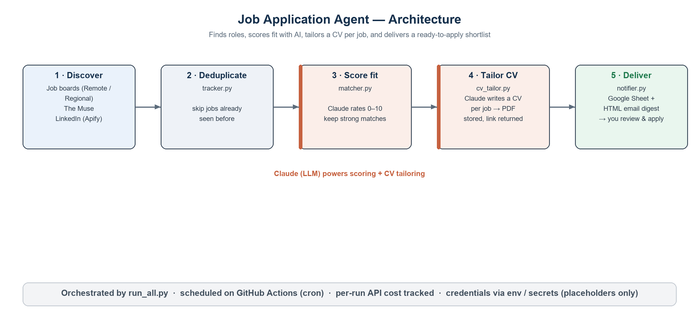
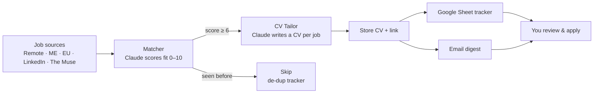
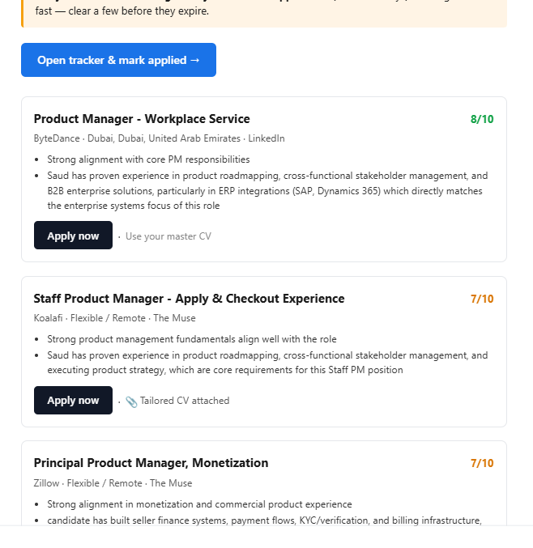
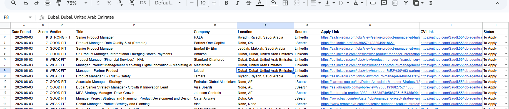
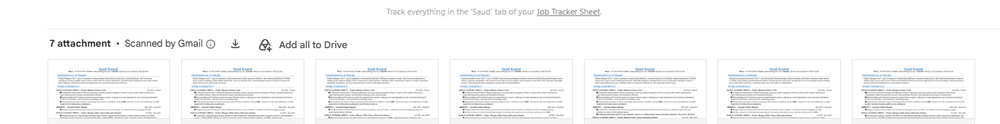

# Job Application Agent

**An autonomous agent that finds relevant jobs, scores them with AI, writes a tailored CV for each one, and emails you a ready-to-apply shortlist — on a schedule, hands-free.**



## What it does

Job hunting at scale is repetitive: search several boards, read each posting, judge fit, and rewrite your CV for every role. This agent does all of that automatically. A few times a week it pulls fresh postings from multiple sources, uses Claude to score each one against your profile, generates a CV tailored to the jobs worth applying to, and sends you a single digest with apply links and the matching CV attached. You just review and click apply.

## Key features

- **Multi-source discovery** — pulls roles from remote boards, regional feeds (Middle East / Europe), LinkedIn (via a paid scraping actor), and The Muse.
- **AI fit scoring** — Claude rates every posting 0–10 against your profile; only strong matches (≥6) move forward, so you never wade through noise.
- **Per-job tailored CVs** — generates a CV rewritten for each matched role, emphasising the most relevant experience.
- **De-duplication** — remembers what it has already seen, so you're only shown new jobs.
- **One clear digest** — results land in a Google Sheet tracker and an HTML email summary with score, company, apply link, and the tailored CV.
- **Status tracking** — each role moves through a pipeline (To Apply → Applied → Interview → Offer / Rejected).
- **Runs itself** — scheduled on GitHub Actions; your machine can be off.

## How it works



1. **Discover** — each source module returns normalised postings.
2. **Score & filter** — `matcher.py` asks Claude to rate fit; `tracker.py` drops anything already seen.
3. **Tailor** — `cv_tailor.py` generates a role-specific CV; `drive_uploader.py` stores it and returns a link.
4. **Notify** — `notifier.py` writes the row to a Google Sheet and emails the summary.
5. **Orchestrate** — `run_all.py` runs the whole cycle; GitHub Actions fires it on a cron.

## Tech stack

- **Language:** Python
- **AI:** Anthropic Claude (scoring + CV generation)
- **Data sources:** job-board feeds + Apify actors (incl. paid LinkedIn scraper)
- **Output:** Google Sheets API, Gmail SMTP (HTML email)
- **Automation:** GitHub Actions (scheduled cron)

All credentials are supplied via environment variables / GitHub Actions secrets — see `.gitignore`. Use placeholders like `YOUR_EMAIL`, `YOUR_PHONE` when configuring.

## Screenshots

**Email digest — scored matches with apply links**



**Google Sheet tracker — one row per job (score, verdict, apply + CV links, status)**



**Tailored CVs — a role-specific CV generated and attached per job**



## Configuration

Your profile lives in `users/_TEMPLATE.json` (copy it to `users/<you>.json` and fill it in). Set the required environment variables (Anthropic, Apify, Google, email) before running:

```bash
pip install -r requirements.txt
python run_all.py
```

## Note

This is a personal project built to automate my own job search, shared here as a portfolio piece. It is provided as-is; configure it with your own credentials and profile. No real secrets or personal contact details are included in this repository.
